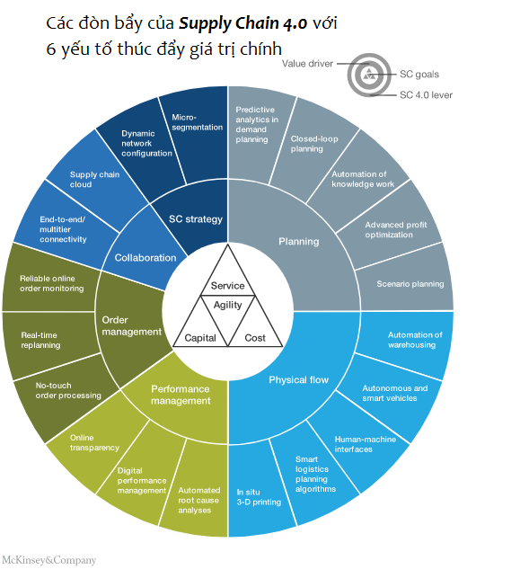

# SCM 4.0

Trong ``Supply Chain 4.0, quản lý chuỗi cung ứng áp dụng các sáng kiến về Industry 4.0`` – Internet of Things, robot tiên tiến, phân tích, và dữ liệu khổng lồ (big data) để tạo ra bước nhảy vọt trong hiệu quả hoạt động và sự hài lòng của khách hàng.

Trọng tâm của chức năng quản lý chuỗi cung ứng đã chuyển sang các quy trình lập kế hoạch nâng cao, như ``lập kế hoạch nhu cầu phân tích hoặc kế hoạch bán hàng và vận hành tích hợp (S & OP)``, mà đã trở thành quy trình kinh doanh lâu đời ở nhiều công ty, trong khi logistics về mặt vận hành thường được thuê ngoài cho nhà cung cấp dịch vụ logistics bên thứ ba ``(third-party logistics providers – 3PL)``. Chức năng chuỗi cung ứng đảm bảo rằng các hoạt động được tích hợp tốt, từ các nhà cung cấp tới khách hàng, với các quyết định về chi phí, hàng tồn kho, và dịch vụ khách hàng được thực hiện bởi tầm nhìn xuyên suốt từ điểm đầu đến điểm cuối chứ không phải bởi mỗi chức năng một cách độc lập.

``Số hóa hay kỹ thuật số hóa (digitalization hay digitization) tạo ra sự đột phá hay sự gián đoạn (disruption) và đòi hỏi các công ty phải suy nghĩ lại cách thiết kế chuỗi cung ứng của họ``. Trong khi đó, sự mong đợi của khách hàng đang tăng lên: các xu hướng trực tuyến gần đây đã dẫn đến sự mong đợi về dịch vụ gia tăng kết hợp với đơn đặt hàng chi tiết hơn. Ngoài ra, một xu hướng rõ nét hướng tới việc cá nhân hóa và tùy biến hóa đang thúc đẩy tăng trưởng mạnh mẽ và những thay đổi liên tục trong danh mục SKU. Sự minh bạch nhờ vào trực tuyến và sự dễ dàng truy cập vào vô số các lựa chọn liên quan đến địa điểm mua sắm và mặt hàng mua sắm đang thúc đẩy cạnh tranh của các chuỗi cung ứng.

## Tầm nhìn và tương lai

### Nhanh hơn

Các tiếp cận mới về phân phối sản phẩm có thể làm giảm thời gian giao hàng đến vài giờ. Bằng cách nào?

Các phương pháp tiếp cận dự báo nâng cao, chẳng hạn như ``phân tích tiên đoán (predictive analytics)`` dữ liệu nội bộ (ví dụ nhu cầu) và dữ liệu bên ngoài (ví dụ như xu hướng thị trường, thời tiết, kỳ nghỉ của trường học, chỉ số xây dựng), khi kết hợp với dữ liệu trạng thái của máy cho nhu cầu phụ tùng, giúp cung cấp dự báo chính xác hơn về nhu cầu của khách hàng.

Những điều mà trước đây từng được dự báo hàng tháng bây giờ trở thành hàng tuần – và, đối với những sản phẩm tiêu dùng nhanh nhất, là hàng ngày. Trong tương lai, chúng ta sẽ thấy`` “vận chuyển tiên đoán” (predictive shipping)``, mà Amazon giữ bằng sáng chế: Sản phẩm được vận chuyển trước khi khách hàng đặt hàng. Đơn đặt hàng của khách hàng sau đó được kết hợp với lô hàng đã có trong mạng lưới logistics rồi và lô hàng được định tuyến lại để đến điểm đích chính xác của khách hàng.

### Linh hoạt hơn

Lập kế hoạch tùy biến, theo thời gian thực (real-time) của Supply Chain 4.0 cho phép các công ty phản ứng linh hoạt với ``sự thay đổi về nhu cầu hoặc nguồn cung, giảm thiểu chu kỳ lập kế hoạch và thời gian đóng băng``. Lập kế hoạch trở thành quy trình liên tục có thể phản ứng tự động với các hạn chế và yêu cầu luôn thay đổi (ví dụ: phản hồi năng lực sản xuất theo thời gian thực từ các máy móc). Ngay cả sau khi sản phẩm đã được gửi, quy trình phân phối nhanh cho phép khách hàng định tuyến lại chuyến hàng đến đích đến thuận tiện nhất.

Các mô hình kinh doanh mới làm tăng tính linh hoạt của tổ chức chuỗi cung ứng. Thay vì duy trì nguồn lực và năng lực nội bộ, các công ty có thể thuê ngoài các chức năng chuỗi cung ứng riêng rẻ như là một dịch vụ trên cơ sở sử dụng. Sự chuyên môn hoá ngày càng cao của các nhà cung cấp dịch vụ tạo ra tính kinh tế theo quy mô và phạm vi, tăng khả năng thu hút các cơ hội thuê ngoài hấp dẫn.

Hiện tượng ``‘Uber hóa” vận tải – năng lực vận chuyển linh hoạt, chia sẻ đám đông`` – cũng sẽ làm tăng đáng kể sự nhanh nhẹn trong các mạng lưới phân phối. Do đó, các nhà sản xuất có thể nhận thấy nhiều cơ hội mới đưa sản phẩm trực tiếp tới người tiêu dùng trong lĩnh vực mà từng chỉ là sân chơi cho các nhà bán lẻ.

### Chi tiết hơn

Với việc khách hàng đang tìm kiếm ngày càng nhiều sự cá nhân hóa trong các sản phẩm họ mua, các công ty phải quản lý nhu cầu ở mức độ chi tiết hơn, thông qua các kỹ thuật như ``phân khúc siêu nhỏ (microsegmentation)``, tùy biến hóa và thực hiện lập kế hoạch phức tạp hơn. Các khái niệm phân phối mang tính đổi mới, bao gồm cả việc chuyển bằng máy bay không người lái (drone), sẽ cho phép các công ty quản lý chặng cuối (last-mile) hiệu quả hơn cho các nhu cầu tùy biến của khách hàng một cách nhanh chóng hơn có thể như hiện nay với thị trường đại trà, sản phẩm chuẩn hóa.

### Chính xác hơn

``Các hệ thống quản lý hiệu suất thế hệ tiếp theo cung cấp sự minh bạch từ điểm đầu đến điểm cuối và theo thời gian thực (real-time) ``trong toàn bộ chuỗi cung ứng. Phạm vi thông tin có được từ các chỉ số hoạt động chính được tổng hợp ở cấp độ cao nhất, chẳng hạn như mức dịch vụ tổng thể, đến các dữ liệu quy trình ở cấp độ rất chi tiết, chẳng hạn như vị trí chính xác của xe tải trong mạng lưới. Việc tích hợp dữ liệu từ các nhà cung cấp, các nhà cung cấp dịch vụ và những bên khác trong “chuỗi cung ứng đám mây” (supply chain cloud) đảm bảo rằng tất cả các bên liên quan trong chuỗi cung ứng điều khiển và quyết định dựa trên cùng sự kiện thực tế.

### Hiệu quả hơn

``Tự động hoá (automation) cả các tác vụ tay chân và lập kế hoạch sẽ nâng cao hiệu quả chuỗi cung ứng.`` Robot xử lý vật liệu (palet, hộp, từng mảnh riêng lẻ), hoàn toàn tự động quá trình kho từ nhận / dỡ xuống, đưa ra, đến chọn, đóng gói và vận chuyển. Xe tải tự động vận chuyển các sản phẩm trong mạng lưới.

Để tối ưu hóa việc sử dụng xe tải và tăng tính linh hoạt trong vận tải, các công ty chia sẻ năng lực thông qua việc tối ưu hoá (optimization) vận tải giữa các công ty. Việc thiết lập mạng lưới bản thân nó liên tục được tối ưu hóa để đảm bảo phù hợp tối ưu nhất cho các yêu cầu kinh doanh.

## Lập kế hoạch

Lập kế hoạch chuỗi cung ứng sẽ thu được lợi ích rất lớn từ dữ liệu khổng lồ ``(big data) và phân tích tiên tiến (advanced analytics)``, cũng như từ việc tự động hóa công việc kiến thức. Một vài nhà sản xuất hàng tiêu dùng lớn đang sử dụng phân tích tiên đoán trong lập kế hoạch nhu cầu để phân tích hàng trăm các biến nội tại và bên ngoài tác động đến nhu cầu (ví dụ như thời tiết, xu hướng từ mạng xã hội, dữ liệu cảm biến), sử dụng phương pháp máy học (machine learning) để mô hình hóa các mối quan hệ phức tạp và xuất ra một kế hoạch nhu cầu chính xác.`` Sai sót dự báo thường giảm khoảng 30%-50%``.

Lập kế hoạch cung và cầu được tích hợp mạnh mẽ, được tự động nhiều đã phá vỡ ranh giới truyền thống giữa các bước lập kế hoạch khác nhau và biến đổi việc lập kế hoạch thành quy trình linh hoạt, liên tục. Thay vì sử dụng các nguồn tồn kho an toàn cố định, mỗi nhiệm vụ ``lập kế hoạch bổ sung nguồn hàng (replenishment)`` xem xét phân phối xác suất của nhu cầu dự kiến. Do đó, các tồn kho an toàn ẩn thì khác với mỗi đơn tái đặt hàng. Giá cả có thể được linh hoạt điều chỉnh để tối ưu hóa lợi nhuận và giảm thiểu hàng tồn kho cùng một lúc.

Trong ngành công nghiệp hàng tiêu dùng, một số tập đoàn toàn cầu nổi tiếng nhất đang sử dụng các phương pháp lập kế hoạch tiên tiến và có thể thấy rằng hiện đang có một mối quan tâm mạnh mẽ trong ứng dụng rộng hơn đối với phương pháp này.

## Dòng chảy vật lý – Physical Flow

Logistics sẽ có một bước tiến lớn thông qua tính kết nối tốt hơn, và ``phân tích tiên tiến (advanced analytics)``, công nghệ in 3D (3D printing hay còn gọi là additive manufacturing – AM), và tự động hóa tiên tiến, chiến lược đổi mới quản lý hàng tồn kho và nhà kho. Các giao diện dễ sử dụng như thiết bị đeo sẵn đã cho phép các chỉ dẫn dựa trên địa điểm cho người lao động, hướng dẫn quá trình lấy sản phẩm. Các robot tiên tiến có thể có những ảnh hưởng đáng kể tương đương với năng suất của con người trong nhà kho.

Các phương tiện vận tải thông minh và tự vận hành sẽ dẫn đến việc giảm chi phí vận hành và xử lý sản phẩm đáng kể,`` đồng thời giảm thời gian vận chuyển (lead time) và chi phí môi trường``. Liên kết nhà kho với các điểm chất hàng tại nơi sản xuất thậm chí có thể cho phép thực hiện toàn bộ quy trình với sự can thiệp thủ công tối thiểu. Cuối cùng, khi các cơ sở sản xuất bắt đầu dựa nhiều vào việc in ấn 3D, vai trò của nhà kho có thể thay đổi về cơ bản.

### Quản lý hiệu suất – Performance Management

Quản lý hiệu suất cũng đang thay đổi rất nhiều, với việc một số công ty thực phẩm lớn dẫn đầu trong việc đưa ra bảng điều khiển (dashboards) chi tiết, liên tục cập nhật, dễ dàng tùy biến trên khắp các tổ chức của họ. Đã qua rồi những ngày khi mà tổng hợp bảng điều khiển là một nhiệm vụ chính và các chỉ số hiệu suất chỉ có sẵn ở cấp độ tổng hợp. Thay vào đó, ``quản lý hiệu suất đang trở thành một quy trình hoạt động thực sự xử lý các ngoại lệ trong thời gian thực (real-time)`` và cải tiến liên tục chứ không phải là một nhiệm vụ tổng hợp thông tin trở về trước trên cơ sở hàng tháng hoặc hàng quý.

Bằng cách sử dụng các kỹ thuật ``khai thác dữ liệu (data mining) và máy học (machine learning)``, loại hệ thống quản lý hiệu suất cải tiến này có thể xác định nguyên nhân gốc rễ của ngoại lệ bằng cách so sánh nó với một bộ các chỉ số cơ bản được xác định trước hoặc bằng cách tiến hành phân tích dữ liệu khổng lồ (big data). Sau đó, hệ thống có thể tự động kích hoạt các biện pháp đối phó, chẳng hạn như bằng cách kích hoạt đơn đặt hàng bổ sung (replenishment) hoặc thay đổi hàng tồn kho an toàn hoặc các định dạng thông số khác trong hệ thống lập kế hoạch.

## Quản lý đơn hàng – Order Management

Quản lý đơn đặt hàng được cải thiện thông qua một loạt các biện pháp: ``xử lý đơn đặt hàng tự động tích hợp hệ thống đặt hàng với quy trình sẵn có (vailable-to-promise – ATP) và lập kế hoạch lại theo thời gian thực`` cho phép xác nhận đơn hàng cùng ngày qua việc xây dựng lại ngay lập tức lịch trình sản xuất và nhu cầu đặt hành bổ sung (replenishment) có xem xét tất cả các trở ngại. Kết quả ròng là chi phí giảm (thông qua tự động được tăng lên), độ tin cậy được cải thiện (thông qua phản hồi chi tiết) và kinh nghiệm của khách hàng tốt hơn (thông qua phản hồi ngay lập tức và đáng tin cậy).

## Sự cộng tác – Collaboration

``Đám mây chuỗi cung ứng (supply chain cloud) hình thành nên cấp độ tiếp theo của sự cộng tác trong chuỗi cung ứng``. Các đám mây chuỗi cung ứng là các chuỗi cung ứng chung giữa khách hàng, công ty và nhà cung cấp, mang lại một cơ sở hạ tầng logistics chia sẻ hoặc thậm chí các giải pháp lập kế hoạch chung. Đặc biệt trong các mối quan hệ phi cạnh tranh, các đối tác có thể quyết định giải quyết các nhiệm vụ của chuỗi cung ứng với nhau để tiết kiệm chi phí hành chính và học hỏi lẫn nhau.

Một tập đoàn tiêu dùng hàng đầu đã nhận thấy rằng sự cộng tác trong chuỗi giá trị cho phép hàng tồn kho thấp hơn nhiều thông qua việc trao đổi các dữ liệu lập kế hoạch đáng tin cậy. Nó cũng giảm thời gian (lead time) nhờ vào thông tin tức thì trong toàn bộ chuỗi, đồng thời cung cấp một hệ thống cảnh báo sớm và khả năng phản ứng nhanh với những sự gián đoạn (disruption) ở bất cứ đâu.

## Chiến lược chuỗi cung ứng – SC Strategy

Thể theo nhu cầu cá nhân hoá và tuỳ biến của chuỗi cung ứng, ``các thiết lập chuỗi cung ứng đang chấp nhận thêm nhiều phân khúc khác nhau``. Để vượt trội trong thiết lập này, các chuỗi cung ứng cần phải nắm vững các phân khúc siêu nhỏ. Một cách tiếp cận năng động, dữ liệu khổng lồ cho phép tùy biến hàng loạt các chuỗi cung ứng bằng cách tách mỗi chuỗi cung ứng ra thành hàng trăm phân khúc chuỗi cung ứng cá nhân, mỗi nhóm dựa trên yêu cầu của khách hàng và năng lực của công ty. Các sản phẩm phù hợp cung cấp giá trị tối ưu cho khách hàng và giúp giảm thiểu chi phí và tồn kho trong chuỗi cung ứng.

## Tác động của Supply Chain 4.0

Việc loại bỏ lãng phí nhờ vào kỹ thuật số ngày nay và áp dụng các công nghệ mới cùng nhau đã tạo nên một đòn bẩy quan trọng giúp tăng hiệu quả hoạt động của chuỗi cung ứng. Những tác động tiềm năng của chuỗi cung ứng 4.0 (Supply Chain 4.0) trong hai đến ba năm tới là rất lớn. Dựa trên kinh nghiệm của với nhiều nghiên cứu và tính toán định lượng, McKinsey đã tính toán rằng những kỳ vọng bao gồm ``chi phí hoạt động giảm xuống tới 30%, giảm tổn thất trong doanh thu 75% và giảm hàng tồn kho đến 75%``. Đồng thời, ``sự nhanh nhạy của các chuỗi cung ứng sẽ tăng đáng kể.``

Sự chuyển đổi sang chuỗi cung ứng kỹ thuật số
Việc chuyển đổi sang một chuỗi cung ứng kỹ thuật số (digital supply chain) đòi hỏi 3 yếu tố then chốt: một định nghĩa rõ ràng, các năng lực mới và một môi trường hỗ trợ.

Định nghĩa chuỗi cung ứng kỹ thuật số (digital supply chain) bắt đầu với sự hiểu biết về những lãng phí trong thời đại kỹ thuật số của hoạt động hiện tại. Cần phải xây dựng các năng lực về số hóa; thông thường là yêu cầu tuyển dụng các chuyên gia. Điều kiện tiên quyết cuối cùng là việc triển khai kiến trúc / tổ chức 2 tốc độ. Điều này có nghĩa là việc thiết lập của tổ chức và cảnh quan công nghệ thông tin phải đi kèm với việc tạo ra một môi trường đổi mới với văn hoá khởi nghiệp.