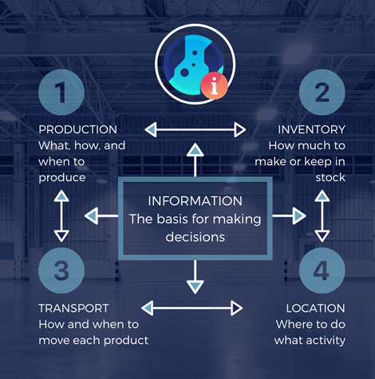
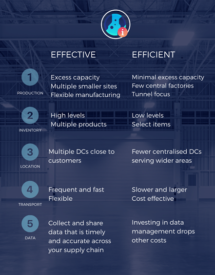
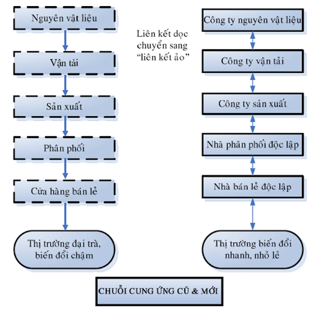
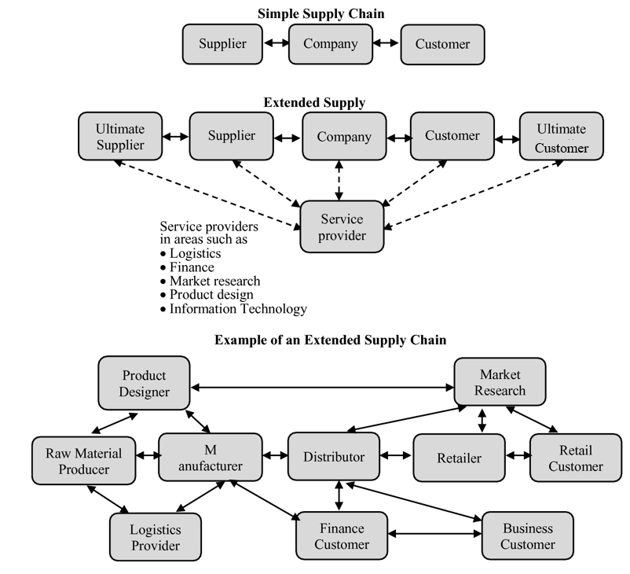

## Tổng quan quản trị chuỗi cung ứng

- Khái niệm, nhiệm vụ chuỗi cung ứng
- Định nghĩa các tổ chức khác nhau tham gia chuỗi cung ứng
- Cách tích hợp chuỗi cung ứng vào chiến lược kinh doanh

### Khái niệm chuỗi cung ứng

Chuỗi cung ứng:

- Một chuỗi cung ứng là **sự sắp xếp, bố trí** các công ty để mang **sản phẩm và dịch vụ đến với thị trường**.
- Một chuỗi cung ứng bao **gồm tất cả các giai đoạn cấu thành**, trực tiếp hoặc gián tiếp, trong việc **đáp ứng yêu cầu của khách hàng**. Chuỗi cung ứng không chỉ bao **gồm các nhà sản xuất và cung ứng**, mà còn bao **gồm các nhà vận tải, kho hàng, nhà bán lẻ và chính khách hàng**.
- Một chuỗi cung ứng là **một mạng lưới của những điều kiện và những lựa chọn phân phối** được thực hiện dưới dạng chức năng mua sắm nguyên liệu, biến đổi những nguyên liệu này thành những sản phẩm trung gian hay thành phẩm, và sự phân phối những sản phẩm hoàn thiện này đến với khách hàng.

Quản trị chuỗi cung ứng:

- Là sự **kết hợp của sản xuất, hàng tồn kho, địa điểm và vận tải giữa các bên tham gia trong một chuỗi cung ứng** để đạt được sự kết hợp tốt nhất giữa sự phản ứng với thị trường và hiệu quả kinh doanh để phục vụ thị trường đó.

Các nhân tố chính: 

- Sản xuất **(Production)**: Sản xuất cái gì, bằng cách nào và khi nào?
- Hàng tồn kho **(Inventory)**: Sản xuất bao nhiêu và lưu trữ bao nhiêu?
- Địa điểm **(Location)**: Đâu là nơi tốt nhất để thực hiện các hoạt động?
- Vận chuyển **(Transportation)**: Vận chuyển sản phẩm như thế nào và khi nào?
- Thông tin **(Information)**: Cơ sở để đưa ra quyết định.

***Sản xuất***: là khả năng tạo ra và lưu trữ sản phẩm của chuỗi cung ứng. --> Quyết định sản xuất dựa trên việc giải quyết vấn đề thương mại giữa **Sự phản ứng nhanh** và **Tính hiệu quả**. 

*Tính phản ứng nhanh*: Xây dựng nhà máy có công suất dư thừa, kĩ thuật sản xuất linh hoạt để sản xuất nhiều sản phẩm đa dạng. Sản xuất tại nhiều nhà máy nhỏ gần KH để giảm thời gian giao hàng.

*Tính hiệu quả*: Xây dựng nhà máy với rất ít công suất dư thừa và tối ưu hoá việc vận hành để sản xuất sản phẩm có chủng loại giới hạn. Tập trung sản xuất tại các nhà máy trung tâm lớn để đạt hiệu quả kinh tế quy mô.

Hai phương pháp sản xuất: Tập trung vào sản phẩm, Tập trung vào chức năng

Ba phương pháp xây dựng kho hàng: Lưu kho theo đơn vị (Stock Keeping Unit), Lưu kho theo công năng (Job Lot Storage), Lưu kho trung chuyển (Crossdocking)

***Hàng tồn kho*** xuất hiện ở khắp chuỗi cung ứng và bao gồm mọi thứ, từ nguyên liệu thô đến các thành phẩm nằm trong tay nhà sản xuất, nhà phân phối và nhà bán lẻ trong một chuỗi cung ứng. 

*Tính phản ứng nhanh*: Dự trữ lượng tồn kho cao cho một loạt sản phẩm. Cất giữ sản phẩm tại nhiều địa điểm để có sẵn hàng tồn kho, cung cấp cho KH càng nhanh càng tốt.

*Tính hiệu quả*: Giảm lượng hàng tồn kho đối với tất cả mặt hàng. Dự trữ hàng tồn kho trong một vài địa điểm ở vị trí trung tâm để giảm chi phí mà vẫn đạt lợi thế kinh tế quy mô.

Nhà quản lý phải **định vị** họ nằm ở vị trí nào để **cân bằng** giữa Sự phản ứng nhanh và Tính hiệu quả. 

Quyết định giữ hàng tồn kho khi: 

- Hàng tồn kho theo chu kỳ **(Cycle inventory)**: Lượng hàng cần thiết để đáp ứng nhu cầu KH trong giai đoạn giữa những lần mua sản phẩm. 
- Hàng tồn kho an toàn **(Safety inventory)**: Đóng vai trò như bộ phận giảm xóc để đối phó với sự thiếu chắc chắn.
- Hàng tồn kho theo mùa **(Seasonal inventory)**: Được dự trữ theo những dự báo về sự tăng nhu cầu thị trường ở một thời điểm nào đó trong năm.

***Địa điểm*** Là vị trí địa lý của các cơ sở trong chuỗi cung ứng. Cũng bao gồm quyết định về việc cơ sở nào tiến hành những hoạt động cụ thể nào.

**Sự cân bằng giữa Sự phản ứng nhanh và Tính hiệu quả** là quyết định có nên tập trung mọi hoạt động ở một vài địa điểm hay chia nhỏ hoạt động đến nhiều địa điểm khác nhau.

*Tính phản ứng nhanh*: Mở nhiều địa điểm để tiếp cận gần hơn với KH.

*Tính hiệu quả*: Chỉ vận hành ở một vài địa điểm và tập trung hoạt động tại các địa điểm chung.

Yếu tố cần xem xét khi quyết định vị trí địa lý: 

- chi phí hạ tầng doanh nghiệp
- chi phí lao động, kỹ năng sẵn có của lực lượng lao động
- điều kiện cơ sở hạ tầng xung quanh
- thuế và các loại phí
- sự gần gũi về mặt địa lý với nhà cung cấp và KH.

Quyết định về địa điểm phản ánh chiến lược cơ bản của công ty trong việc xây dựng và phân phối sản phẩm với thị trường. 

***Vận tải*** Là sự di chuyển giữa nhưng cơ sở khác nhau trong một chuỗi cung ứng, từ nguyên liệu thô đến thành phẩm. 

**Sự cân bằng giữa Sự phản ứng nhanh và Tính hiệu quả** thể hiện trong việc chọn lựa phương thức vận chuyển. 

*Tính phản ứng nhanh*: Đạt được thông qua phương thức vận chuyển nhanh chóng và linh hoạt.

*Tính hiệu quả*: Chú trọng khi vận chuyển theo lô lớn với tần suất thưa hơn. Hiệu quả hơn nếu vận chuyển bắt đầu từ một cơ sở trung tâm thay vì từ nhiều chi nhánh.

Sáu phương tiện vận tải cơ bản:

- **Tàu thuỷ**: Hiệu quả về chi phí nhưng lại chậm nhất. Chỉ sử dụng được ở những nơi có giao thông đường thuỷ như cảng biển hay kênh đào.
- **Tàu hoả**: Rất có lợi về chi phí nhưng cũng rất chậm. Bị giới hạn khi chỉ sử dụng ở những nơi có đường sắt.
- **Đường ống**: Rất hiệu quả nhưng bị giới hạn cho các loại hàng hoá hoá lỏng hoặc khí như nước, dầu, khí tự nhiên.
- **Xe tải**: Tương đối nhanh và rất cơ động. Chi phí dựa trên sự biến động của giá nhiên liệu và điều kiện của đường sá.
- **Máy bay**: Có tính phản ứng nhanh rất cao nhưng đắt đỏ nhất và bị giới hạn bởi sự sẵn có của hạ tầng sân bay.
- **Vận chuyển bằng điện**: Vận chuyển nhanh nhất, linh hoạt và hiệu quả về mặt chi phí nhưng chỉ thích hợp với các loại sản phẩm như năng lượng điện, dữ liệu và dữ liệu kỹ thuật số. 

***Thông tin*** Là nhân tố cơ bản mà dựa vào đó, những quyết định liên quan đến bốn nhân tố còn lại của chuỗi cung ứng được hình thành. 

Cần dữ liệu chính xác, kịp thời và hoàn thiện --> đưa ra quyết định

*Tính phản ứng nhanh*: Ứng dụng công nghệ thu thập và chia sẻ thông tin, dữ liệu chính xác, kịp thời.

*Tính hiệu quả*: Hạn chế chia sẻ thông tin để tránh nguy cơ thông tin được sử dụng để chống lại. Tuy nhiên, thông tin chỉ có hiệu quả ngắn hạn và sẽ kém hiệu quả sau một thời gian vì chi phí thông tin giảm.

Thông tin được sử dụng cho hai mục đích:

- **Liên kết những hoạt động hàng ngày**: Sử dụng những dữ liệu có sẵn về cung ứng sản phẩm và nhu cầu để quyết định lịch sản xuất hàng tuần, mức hàng tồn kho, lộ trình vận chuyển và điểm trữ hàng.
- **Dự báo và lập kế hoạch**: Để đoán trước nhu cầu tương lai. Sử dụng để thực hiện những dự báo chiến thuật nhằm thiết lập lịch sản xuất và thời gian biểu hàng tháng và hàng quý. Sử dụng cho những dự báo chiến lược, đưa ra quyết định có nên xây dựng cơ sở mới, tham gia thị trường mới hay rút chân khỏi thị trường hiện tại hay không.

Trong phạm vi một công ty riêng biệt: **Sự cân bằng giữa Sự phản ứng nhanh và Tính hiệu quả** bao gồm việc đánh giá lợi ích mà thông tin tốt mang lại so với chi phí để có được thông tin đó.

Trong phạm vi một chuỗi cung ứng: **Sự cân bằng giữa Sự phản ứng nhanh và Tính hiệu quả** là một trong những nhân tố quyết định bao nhiêu thông tin nên được chia sẻ cho các công ty khác và bao nhiêu thông tin nên được giữ lại.

### Các mô hình

***Liên kết theo hàng dọc***: Cố gắng làm chủ phần lớn hoặc toàn bộ chuỗi cung ứng của mình. Mục tiêu nhằm đạt được hiệu quả tối đa thông qua lợi thế kinh tế nhờ quy mô. 

***Liên kết ảo***: Các chuỗi cung ứng phải linh hoạt và phản ứng tốt hơn. Các công ty cần tập trung vào năng lực cốt lõi và liên kết các công ty khác. 

### Chuỗi cung ứng mới

Toàn cầu hoá, thị trường cạnh tranh cao và tốc độ thay đổi nhanh của công nghệ định hình sự phát triển của chuỗi cung ứng mới.

Nhân lực trong mỗi công ty có thể bắt kịp với tốc độ thay đổi nhanh chóng và tiếp tục học.

Liên kết theo hàng dọc đã nhường chỗ cho Liên kết ảo.

Những bên tham gia: 

- Chuỗi cung ứng cơ bản: Nhà cung cấp, Công ty, Khách hàng.
- Chuỗi cung ứng mở rộng có thêm: Nhà cung cấp khởi đầu **(Ultimate Supplier)**, Khách hàng cuối cùng **(Ultimate Customer)**, Toàn bộ các công ty cung cấp dịch vụ cho các công ty khác trong chuỗi cung ứng **(Extended Supply Chains)**.
- Các công ty thực hiện chức năng khác nhau: Nhà sản xuất, Nhà phân phối, Nhà bán lẻ, Khách hàng, Nhà cung cấp dịch vụ.

**Nhà sản xuất**: Là những tổ chức làm ra sản phẩm (vô hình, hữu hình).

**Nhà phân phối**: Là những công ty lấy một số lượng lớn hàng tồn kho từ nhà sản xuất và phân phối. Có thể đóng vai trò người môi giới sản phẩm giữa người bán và người mua mà không sở hữu sản phẩm đó. 

**Nhà bán lẻ**: Dự trữ hàng tồn kho và bán với số lượng nhỏ cho cộng đồng.

**Khách hàng**: Là bất cứ tổ chức, cá nhân nào mua và sử dụng sản phẩm.

**Nhà cung cấp dịch vụ**: Là tổ chức cung cấp dịch vụ cho các nhà sản xuất, nhà phân phối, nhà bán lẻ và khách hàng.

### Gắn kết chuỗi cung ứng với chiến lược kinh doanh

Có ba bước gắn kết chuỗi cung ứng với chiến lược kinh doanh:

- Hiểu rõ thị trường mà công ty đang phục vụ.
- Xác định điểm mạnh/năng lực cốt lõi của công ty và vai trò của công ty trong việc phục vụ thị trường của mình.
- Phát triển các khả năng chuỗi cung ứng cần thiết để hỗ trợ vai trò mà công ty đã chọn.

***Hiểu thị trường***: Đang phục vụ cho nhóm KH nào? KH của công ty đang bán hàng cho nhóm KH nào? Chuỗi cung ứng công ty tham gia thuộc loại nào?

Những thuộc tính làm rõ yêu cầu của KH:

- **Số lượng sản phẩm cần thiết trong mỗi lô**: KH muốn mua số lượng nhỏ hay số lượng lớn?
- **Thời gian đáp ứng mà KH sẵn sàng chờ đợi**: KH sẽ quyết định mua hàng rất nhanh hay yêu cầu dịch vụ nhanh chóng hay chấp nhận chờ đợi?
- **Tính đa dạng trong nhu cầu về sản phẩm**: KH đang tìm kiếm những nhóm sản phẩm hẹp và được xác định rõ hay đang tìm kiếm một số lượng lớn những sản phẩm khác nhau?
- **Mức độ dịch vụ yêu cầu**: KH muốn tất cả sản phẩm có sẵn để giao ngay hay đồng ý giao hàng làm nhiều đợt và trong thời gian lâu hơn? 
- **Giá của sản phẩm**: KH sẵn sàng trả bao nhiêu tiền?
- **Tỷ lệ đổi mới mong muốn trong sản phẩm**: Các sản phẩm mới được giới thiệu nhanh đến mức nào và sẽ mất bao lâu để sản phẩm hiện có trở nên lỗi thời?

***Xác định năng lực***: Công ty thuộc thành phần nào? Đóng vai trò nào? Có thể làm gì để thúc đẩy chuỗi cung ứng? Năng lực cốt lõi nào? Làm thế nào để kiếm được lợi nhuận? 

Một công ty có thể phục vụ cho nhiều thị trường và tham gia vào nhiều chuỗi cung ứng khác nhau. 

Khi phục vụ cho nhiều phân khúc thị trường, công ty cần tìm cách gia tăng năng lực cốt lõi:

- Một số bộ phận trong chuỗi cung ứng thiết kế đặc biệt cho phân khúc này.
- Trong khi một số bộ phận khác mang tính kết hợp để đạt lợi thế về quy mô kinh tế.
