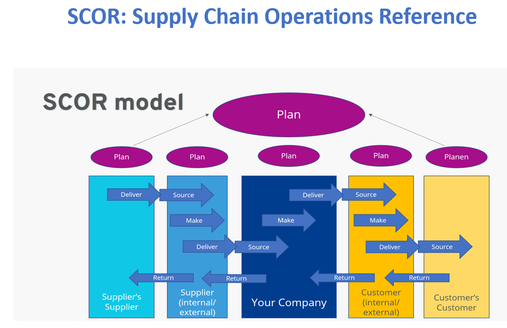
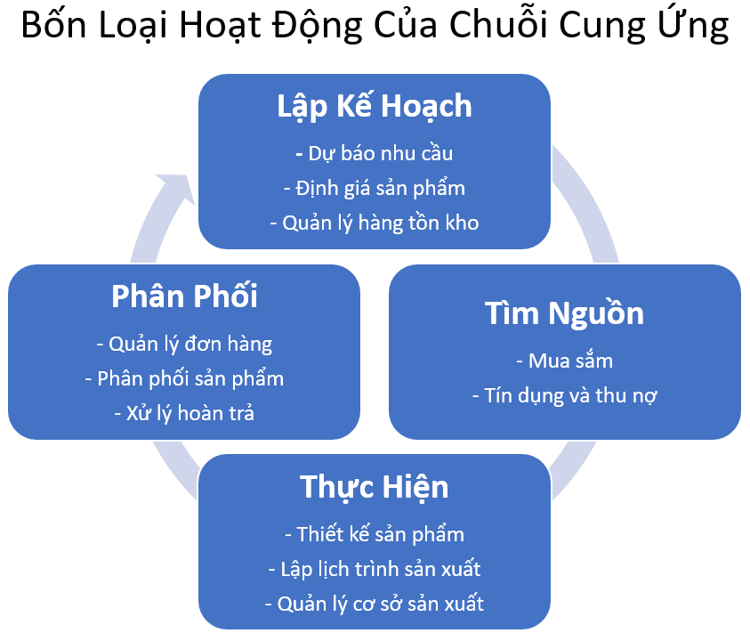
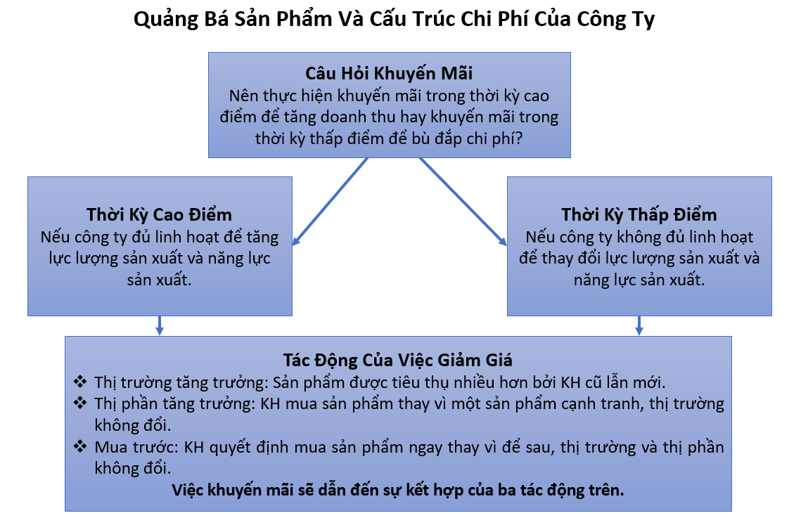
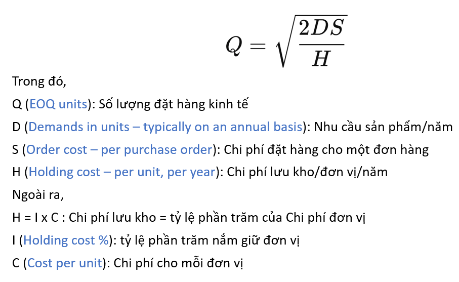
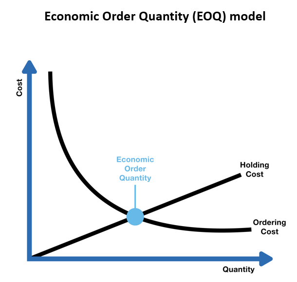
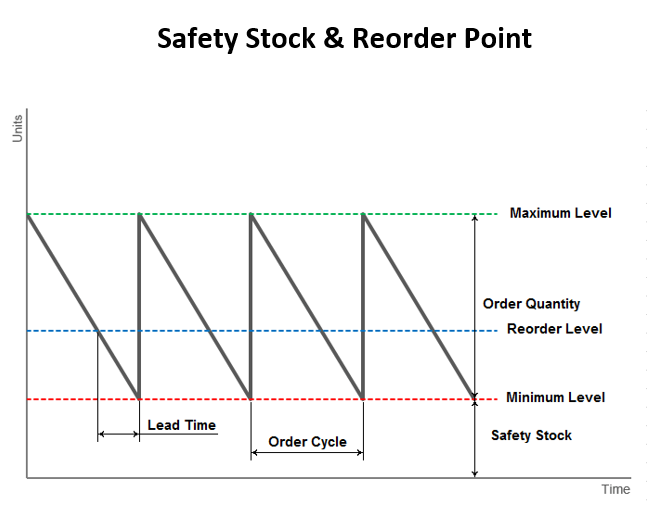
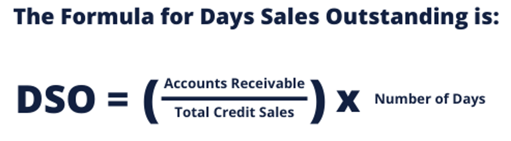

# Lên kế hoạch và Tìm nguồn - Plan and Source

## Mô hình hoạt động Chuỗi cung ứng

- **Plan**: là tất cả những việc cần thiết để lập kế hoạch và tổ chức các hoạt động trong ba hoạt động còn lại.
- **Source**: bao gồm các hoạt động cần thiết để có nguồn đầu vào nhằm tạo ra sản phẩm hoặc dịch vụ.
- **Make**: bao gồm các hoạt động cần thiết để phát triển và sản xuất sản phẩm, dịch vụ mà một chuỗi cung ứng cung cấp.
- **Deliver**: bao gồm các hoạt động nằm trong việc nhận đơn đặt hàng và phân phối sản phẩm cho KH.

## Plan - lập kế hoạch

### Dự báo nhu cầu và lên kế hoạch

***Bốn nhân tố dự báo:***

- Nguồn cung **(Supply)**: số lượng các nhà sản xuất và thời gian từ khi đặt hàng đến giao hàng của một sản phẩm (lead time).
- Nhu cầu **(Demand)**: nhu cầu thị trường tổng thể cho một nhóm sản phẩm hoặc dịch vụ.
- Đặc điểm sản phẩm **(Product Characteristics)**: bao gồm các tính năng của một sản phẩm có ảnh hưởng đến nhu cầu của KH đối với sản phẩm đó.
- Môi trường cạnh tranh **(Competitive Environment)**: những hành động của một công ty và đối thủ cạnh tranh của công ty đó.

***Bốn phương pháp:***

- Định tính **(Qualitative)**: dựa vào trực giác của một người hoặc ý kiến chủ quan về một thị trường. Thích hợp nhất khi có ít dữ liệu lịch sử.

- Nhân quả **(Causal)**: cho rằng nhu cầu có liên quan mạnh mẽ đến các yếu tố môi trường hoặc thị trường cụ thể. 

- Chuỗi thời gian **(Time Series)**: là hình thức dự báo phổ biến nhất, dựa trên giả định rằng mô hình lịch sử của nhu cầu là một chỉ báo tốt đối với nhu cầu trong tương lai. Hữu dụng nhất khi có nguồn dữ liệu lịch sử đáng tin cậy, các thị trường dự báo ổn định và mô hình nhu cầu không thay đổi trong nhiều năm.

- Mô phỏng **(Simulation)**: là kết hợp của Nhân quả và Chuỗi thời gian để mô phỏng hành vi của KH dưới những tình huống khác nhau.

Sử dụng nhiều phương pháp khác nhau rồi kết hợp các kết quả thành dự báo cuối cùng thường mang lại kết quả chính xác hơn chỉ sử dụng duy nhất một phương pháp.

Dự báo ngắn hạn chính xác hơn dài hạn. Dự báo tổng hợp chính xác hơn dự báo cho từng sản phẩm riêng lẻ hoặc cho các phân khúc thị trường nhỏ. 

**Độ sai lệch dự kiến**: ± 5% dự báo chính xác, ± 20% dự báo phỏng đoán. 

### Lập kế hoạch tổng hợp - Aggregrate Planning

Mục đích nhằm đáp ứng nhu cầu để mang lợi nhuận tối đa cho công ty:

- Được thực hiện ở mức độ tổng hợp chứ không phải ở mức độ đơn vị lưu kho (SKU).
- Đặt ra mức độ sản xuất và hàng tồn kho tối ưu vận hành trong 3-18 tháng kế tiếp.

Trở thành khuôn khổ quyết định ngắn hạn:

- **Sản xuất**: tốc độ sản xuất (rate of production), mức độ sử dụng năng lực sản xuất (production capacity), quy mô nhân công, bao nhiêu giờ làm thêm, bao nhiêu thầu phụ sẽ được sử dụng.
- **Hàng tồn kho**: bao nhiêu nhu cầu được đáp ứng ngay bằng hàng có sẵn, bao nhiêu được đáp ứng sau và biến thành đơn hàng chưa thực hiện được (backlog).
- **Phân phối**: cách thức và thời điểm sản phẩm được vận chuyển khỏi nơi sản xuất để đưa đến nơi KH sử dụng hoặc mua sắm.

Ba phương pháp xây dựng kế hoạch tổng hợp:

**Năng lực sản xuất**: 

Mục tiêu: sử dụng toàn bộ năng lực ở tất cả các lần sản xuất bằng cách tăng/giảm năng lực sản xuất hay tuyển dụng/sa thải nhân viên khi cần.

Kết quả: hàng tồn kho ở mức thấp nhưng tốn kém nếu chi phí tăng giảm năng lực sản xuất cao.

Hiệu quả khi: chi phí dự trữ hàng tồn kho cao và chi phí thay đổi năng lực sản xuất, lực lượng lao động thấp.

**Mức độ sử dụng năng lực sản xuất**: 

Mục tiêu: sử dụng khi năng lực sản xuất dư thừa. Quy mô lực lượng lao động duy trì ở mức ổn định, lịch làm thêm giờ linh hoạt, phù hợp với tốc độ sản xuất.

Kết quả: hàng tồn kho thấp và mức độ sử dụng năng lực sản xuất trung bình cũng thấp.

Hiệu quả khi: chi phí dự trữ hàng tồn kho cao và chi phí duy trì năng lực sản xuất dư thừa tương đối thấp.

**Hàng tồn kho dự trữ**:

Mục tiêu: tạo ra sự ổn định trong công suất nhà máy và lực lượng lao động, giúp ổn định tỷ lệ đầu ra. Hàng tồn kho tăng lên trong những giai đoạn nhu cầu thấp để dự phòng, hoặc hàng tồn kho dự trữ thấp và đơn hàng tồn đọng tăng lên.

Kết quả: tăng mức độ sử dụng năng lực sản xuất, giảm chi phí thay đổi năng lực sản xuất nhưng hàng tồn kho và đơn hàng tồn đọng lớn.

Hiệu quả khi: chi phí duy trì năng lực sản xuất dư thừa hoặc thay đổi năng lực sản xuất quá cao trong khi dự trữ hàng tồn kho và duy trì đơn hàng tồn đọng tương đối thấp.

### Định giá sản phẩm

***Bộ phận tiếp thị & bán hàng:*** Khuyến mãi mùa cao điểm => **Tối đa hoá doanh thu**.

***Bộ phận tài chính & sản xuất***: Khuyến mãi mùa thấp điểm => **Tối đa hoá lợi nhuận gộp** trong giai đoạn cao điểm & thúc đẩy doanh thu, bù đắp chi phí trong giai đoạn thấp điểm.

VD: 

Công ty sản xuất hàng điện tử:

- Nhà máy và thiết bị cơ cấu lại nhanh chóng.
- Dự trữ hàng tồn kho tốn kém.
- Sản phẩm nhanh chóng lỗi thời.

=> **Khuyến mãi mùa cao điểm để kích cầu**. Vì có thể nhanh chóng tăng sản lượng, việc giảm tỉ suất lợi nhuận có thể được bù đắp bằng cách tăng tổng doanh thu nếu có thể bán hết sản phẩm đã làm ra.

Công ty sản xuất giấy:

- Thiết bị sản xuất tốn kém, cần nhiều thời gian xây dựng, cần hoạt động ổn định trong cả năm.
- Chi phí dự trữ hàng tồn kho ít tốn kém.
- Sản phẩm không bị lỗi thời, ít bị đánh cắp.

=> **Khuyến mãi mùa thấp điểm để vận hành công suất ổn định**. Trong giai đoạn nhu cầu cao, trọng tâm kinh doanh là duy trì một tỉ suất lợi nhuận tốt. Trong thời gian nhu cầu thấp, cố gắng cân bằng nhu cầu với năng lực sản xuất sẵn có. 

### Quản lý hàng tồn kho

*Ba loại hàng tồn kho:*

- **Hàng tồn kho chu kỳ** (bị ảnh hưởng bởi lợi thế kinh tế nhờ quy mô)
- **Hàng tồn kho theo mùa** (bị ảnh hưởng bởi lợi thế kinh tế nhờ quy mô)
- **Hàng tồn kho an toàn**: bị ảnh hưởng bởi khả năng dự đoán nhu cầu sản phẩm.

***Hàng tồn kho chu kỳ*** Là hàng tồn kho cần thiết để đáp ứng nhu cầu sản phẩm trong khoảng thời gian giữa những lần đặt hàng. Lợi thế kinh tế quy mô: khi có ít đơn hàng hơn và số lượng sản phẩm mỗi đơn hàng lớn.

Ví dụ: 

- Nhu cầu hiện hữu 1 loại sản phẩm của Nhà phân phối là: 100 đơn vị/tuần.
- Đạt hiệu quả chi phí cao nhất khi đặt hàng theo lô: 650 đơn vị.

=> Cứ sáu tuần Nhà phân phối đặt hàng một lần.

- Nhà sản xuất đạt hiệu quả chi phí cao nhất khi sản xuất: 14.000 đơn vị/chu kỳ.

=> Dẫn đến sự tích tụ hàng tồn kho chu kỳ từ phía nhà sản xuất.

Số lượng đặt hàng kinh tế **(Economic Order Quantity)**: 

Ví dụ: Một sản phẩm A có ***nhu cầu sử dụng hàng năm là 240***, ***chi phí cố định*** cho mỗi đơn đặt hàng là ***$5***, ***chi phí mỗi đơn vị là $7***, tỷ lệ % nắm giữ đơn vị là ***30%***. Hãy tính số lượng đặt hàng kinh tế. 

- EOQ = 33.81 làm tròn đến đơn vị gần nhất là 34.
- Nếu nhu cầu sử dụng hàng năm là 240, thì nhu cầu sử dụng hàng tháng là 20.
- EOQ là 34 thì đại diện cho 1¾ tháng cung cấp. Đây không phải là kích cỡ đặt hàng thuận tiện.
- Những thay đổi nhỏ trong EOQ không làm ảnh hưởng đến tổng số đặt hàng và chi phí giữ hàng, vậy tốt nhất làm tròn số lượng EOQ với kích thước đặt hàng tiêu chuẩn gần nhất là 30. 

----------

- Nếu một mặt hàng tồn kho có nhu cầu sử dụng cao và tốn kém => EOQ đề xuất một số lượng đặt hàng thấp: phát sinh nhiều đơn hàng mỗi năm nhưng ít tiền đầu tư vào mỗi đơn hàng. 

- Nếu một mặt hàng tồn kho có nhu cầu sử dụng thấp và không đắt đỏ => EOQ đề xuất một số lượng đặt hàng cao: ít đơn đặt hàng mỗi năm nhưng vì chi phí đơn vị thấp nên vẫn hiệu quả về mặt đầu tư.

----------

**Hàng tồn kho theo mùa** Là hàng tồn kho xảy ra khi một công ty có năng lực sản xuất cố định quyết định sản xuất và dự trữ sản phẩm theo dự đoán nhu cầu tương lai.

- Nếu nhu cầu tương lai vượt quá năng lực sản xuất => sản xuất sản phẩm trong thời điểm nhu cầu thấp và đưa vào hàng tồn kho để đáp ứng nhu cầu trong tương lai.

- Quyết định về hàng tồn kho theo mùa được thúc đẩy bởi mong muốn có được lợi thế kinh tế nhờ quy mô.

- Quản lý hàng tồn kho theo mùa đòi hỏi dự báo nhu cầu chính xác vì một lượng lớn hàng tồn kho có thể trở nên lỗi thời và chi phí lưu giữ tăng lên nếu không được bán ra như dự kiến => Nhà sản xuất cần cung cấp những chính sách ưu đãi về giá nhằm thuyết phục Nhà phân phối mua và lưu trữ trước khi phát sinh nhu cầu.

**Hàng tồn kho an toàn** Là hàng tồn kho rất cần thiết để bù đắp cho sự không chắc chắn trong một chuỗi cung ứng.

- Mức độ không chắc chắn càng cao thì càng đòi hỏi mức tồn kho an toàn.

- Các công ty cần tìm cách cân bằng giữa mong muốn có được một loạt các sản phẩm và đạt được sự sẵn sàng cao cho tất cả, trong khi phải giữ chi phí hàng tồn kho càng thấp càng tốt => Sự cân bằng phản ánh chính số tiền là hàng tồn kho an toàn đang lưu trữ.

4 cách giảm hàng tồn kho an toàn:

- Giảm sự không chắc chắn về nhu cầu: dự báo nhu cầu tốt hơn.
- Giảm thời gian chờ khi đặt hàng (order lead time): thời gian chờ ngắn => cần ít hàng tồn kho an toàn để ứng phó hơn. 
- Giảm sự biến động của thời gian chờ: cắt giảm hàng tồn kho an toàn
- Giảm sự không chắc chắn về nguồn cung: đảm bảo sản phẩm luôn có sẵn khi nhu cầu xuất hiện.

## Tìm nguồn - Source

Mua sắm **(Procurement)** Hoạt động chính của Nhà quản lý mua sắm (Purchasing Manager) là chiến thắng những nhà cung cấp tiềm năng về giá cả và sau đó mua các sản phẩm từ nhà cung ứng với chi phí thấp nhất.

Các chức năng mua sắm chia thành năm loại hoạt động chính: Mua hàng, Quản lý tiêu thụ, Lựa chọn nhà cung cấp, Đàm phán hợp đồng, Quản lý hợp đồng

**Mua hàng** Hai loại sản phẩm (1) nguyên liệu trực tiếp hoặc mang tính chiến lược sản xuất ra sản phẩm để bán; (2) sản phẩm gián tiếp hoặc vật tư, phụ tùng bảo trì, sửa chữa và hoạt động (Maintainace Repair Operation – MRO)

Cơ chế mua hàng giống nhau: quyết định mua hàng, đưa ra đơn mua, liên hệ các nhà cung cấp, đặt đơn hàng

Đảm bảo việc truyền dữ liệu đôi bên kịp thời và chính xác.

**Quản lý tiêu thụ** Nắm được lượng hàng hoá, loại sản phẩm, được mua bởi ai với mức giá nào.

Thường xuyên so sánh mức tiêu thụ dự kiến với thực tế tiêu thụ.

Tiêu thụ trên mong đợi: kỳ vọng không chính xác, cần được khắc phục.

Tiêu thụ thấp hơn kỳ vọng: sự mong đợi không chính xác, có cơ hội cần khai thác.

**Lựa chọn người bán hàng** Tìm kiếm nhà cung cấp phù hợp sau khi xem xét tình hình thu mua và sự đánh giá những gì công ty cần để hỗ trợ kinh doanh và mô hình điều hành.

- Giá trị chất lượng sản phẩm.
- Mức độ dịch vụ.
- Giao hàng đúng lúc.
- Hỗ trợ kỹ thuật.

Thu hẹp số lượng nhà cung cấp để thúc đẩy sức mua với mức giá tốt hơn, đổi lại phải mua một số lượng lớn hơn.

**Đàm phán hợp đồng**

Khi nhu cầu kinh doanh cụ thể phát sinh, hợp đồng phải được đàm phán với từng nhà cung cấp riêng lẻ trong danh sách nhà cung cấp ưa thích. Đây là nơi mặt hàng cụ thể, giá cả và các mức dịch vụ được trình bày. 

Đàm phán đơn giản nhất là hợp đồng mua sản phẩm gián tiếp với các nhà cung cấp được lựa chọn trên cơ sở giá thấp nhất.

Đàm phán phức tạp nhất là hợp đồng mua nguyên vật liệu trực tiếp phải đáp ứng được những yêu cầu chất lượng, mức độ dịch vụ cao và hỗ trợ kỹ thuật cần thiết.

Phải đảm bảo cân bằng giữa đơn giá của một sản phẩm và tất cả các dịch vụ giá trị gia tăng khác.

**Quản lý hợp đồng**

Sau khi hợp đồng được đưa ra, kết quả hoạt động của nhà cung cấp phải được đo lường và quản lý dựa trên thoả thuận trong hợp đồng đó.

Bất kỳ nhà cung cấp nào thường xuyên có kết quả hoạt động dưới mức yêu cầu phải được cảnh báo thiếu sót và khắc phục ngay lập tức.

Các nhà cung cấp nên được giao trách nhiệm theo dõi kết quả hoạt động của chính mình, chủ động đưa ra hành động để giữ hiệu suất trên mức ký kết.

Nhà cung cấp sử dụng VMI (Vendor Managed Inventory) để tiếp cận với các dữ liệu về hàng hóa trong kho cũng như dữ liệu kinh doanh của KH và chịu trách nhiệm điều phối các đơn đặt hàng, giao hàng và lên kế hoạch tồn kho đảm bảo hoạt động kinh doanh luôn được duy trì ở mức tối ưu nhất.

### Tín dụng và thu nợ

Là quá trình tìm nguồn để một công ty nhận được tiền.

Các hoạt động tín dụng cần sàng lọc KH tiềm năng để đảm bảo rằng công ty chỉ kinh doanh với KH có thể thanh toán hoá đơn của mình. Thu nợ là những hoạt động mang lại số tiền mà công ty đã kiếm được.

Quản lý tín dụng tốt là cố gắng đáp ứng nhu cầu của KH với sản phẩm và cũng giảm thiểu số tiền ràng buộc các khoản phải thu.

Phần lớn sự tin tưởng và hợp tác giữa các công ty dựa trên xếp hạng tín dụng tốt và thanh toán hoá đơn kịp thời.

Ba loại hoạt động chính:

- Thiết lập chính sách tín dụng
- Triển khai tín dụng và hoạt động thu nợ
- Quản lý rủi ro tín dụng

**DSO** = Các khoản phải thu / Doanh số bán chịu x Số ngày trong kì

Ví dụ: Trong tháng 4 vừa qua, Công ty A đã kiếm được tổng cộng 5 tỷ đồng doanh số tín dụng và có 3,5 tỷ đồng là khoản phải thu. Có 30 ngày trong tháng 4, vì vậy công ty A có DSO cho tháng 4 được tính như sau:

Thời hạn thu hồi tiền hàng tồn đọng = 3,5/5 × 30 = 0,7 × 30 = 21 (ngày)

**Triển khai tín dụng và hoạt động thu nợ**

Là các hoạt động liên quan đến việc đưa ra và điều hành những thủ tục nhằm thực hiện chính sách tín dụng của công ty.

Làm việc với các nhân viên kinh doanh nhằm đặt ra doanh số bán hàng cụ thể.

Người đảm nhận lĩnh vực tín dụng sẽ làm việc với KH để cung cấp các loại dịch vụ: trả lại sản phẩm, gửi bản ghi nhớ tín dụng cho các sản phẩm trả lại, giải quyết tranh chấp bằng hợp đồng, đơn đặt hàng và hoá đơn.

Hoạt động thu nợ: theo dõi liên tục tình trạng tài khoản trả nợ của KH. Tài khoản quá hạn liên lạc và yêu cầu chi trả các khoản thanh toán.

Có nhiều hình thức thanh toán: chuyển khoản, ngân phiếu, thẻ tín dụng, thẻ mua hàng, thư tín dụng quốc tế.

**Quản lý rủi ro tín dụng**

Quản lý rủi ro có thể được thực hiện bằng cách tạo ra các chương trình tín dụng được thiết kế theo nhu cầu của KH trong phân khúc thị trường nhất định. 

Rủi ro tín dụng có thể được hạ xuống bằng cách sử dụng bảo hiểm tín dụng dựa trên tài khoản KH và bảo lãnh vốn vay chính phủ cho xuất khẩu.

Với những KH quan trọng và những thương vụ đặc biệt lớn, có thể thiết kế một cơ cấu giao dịch riêng biệt => làm tăng giá trị mà công ty cung cấp cho KH và đảm bảo hoạt động kinh doanh mới.
