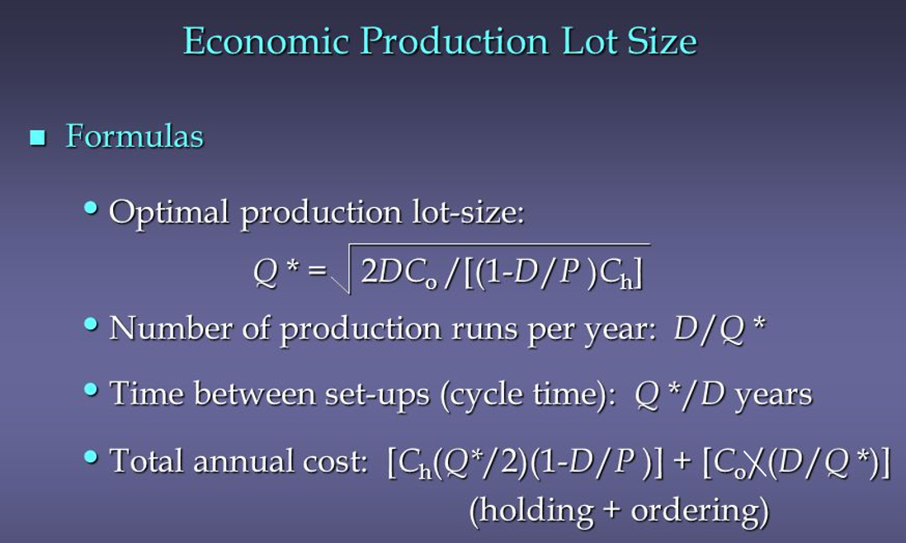
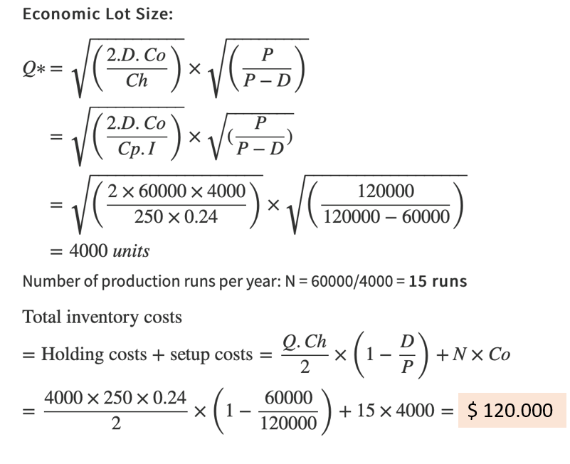

# Thực hiện và Phân phối

## Thực hiện

Bao gồm các hoạt động cần thiết để phát triển và sản xuất sản phẩm, dịch vụ mà một chuỗi cung ứng cung cấp

### Product Design

Là thiết kế và lựa chọn các thiết bị cần thiết để sản xuất dựa trên công nghệ có sẵn và yêu cầu công năng sản phẩm.

Thiết kế sẽ xác định hình dạng của chuỗi cung ứng và điều đó có ảnh hưởng lớn đến chi phí và tính sẵn có của sản phẩm.

Nếu nhà thiết kế, người phụ trách mua sắm và nhà sản xuất có thể phối hợp cùng nhau trong việc tạo ra một sản phẩm, thì cơ hội đạt được thành công và lợi nhuận chắc chắn sẽ lớn hơn.

### Product Scheduling

Nhằm phân bổ năng lực sẵn có (thiết bị, lao động và cơ sở vật chất) cho những công việc cần phải được thực hiện. 

Mục đích là sử dụng năng lực sẵn có một cách hiệu quả nhất và có lợi nhuận cao nhất.

Là quá trình tìm kiếm sự cân bằng liên tục giữa các mục tiêu cạnh tranh mang tính mâu thuẫn nhau:

- Tỷ lệ sử dụng cao: thời gian sản xuất dài, trung tâm sản xuất và phân phối tập trung, tạo ra lợi thế kinh tế nhờ quy mô.
- Mức tồn kho thấp: thời gian sản xuất ngắn, nguyên liệu được giao đúng thời điểm, hạn chế tối đa tài sản và tiền mặt ứ đọng.
- Mức độ dịch vụ KH cao: mức tồn kho cao hoặc nhiều lần sản xuất ngắn, giao hàng nhanh chóng và không bị thiếu hụt hàng tồn kho.

Kích thước lô hàng kinh tế **(Economic Lot Size – ELS)**

Nếu thường xuyên thiết lập và sản xuất theo lô nhỏ => Chi phí dự trữ hàng tồn kho thấp >< Chi phí sản xuất sẽ cao.

Nếu sản xuất dài hơi => Chi phí dự trữ hàng tồn kho cao >< Chi phí sản xuất giảm.

VD: giá mỗi sản phẩm 250$, dự kiến hằng năm 60 000 sản phẩm, chi phí thiết lập là 4000$ / lần, tồn kho tốn 2% chi phí mỗi tháng, chứa 120 000 sản phẩm mỗi năm.

- Demand D: 60 000 per year
- Cost price Cp: 250$ per unit
- Set up costs Co: 4000$ per setup
- Inventory Carrying costs Ch: 2% per mounth
- Production capacity P: 120 000 per year

**Bước thứ hai**, thiết lập trình tự sản xuất cho mỗi sản phẩm dựa trên nguyên tắc:

- Nếu hàng tồn kho cho một sản phẩm thấp hơn nhu cầu dự kiến => Sản phẩm này nên được lên kế hoạch sản xuất trước các sản phẩm khác. 
- Kỹ thuật “Hết thời gian”: là số ngày hoặc số tuần để tiêu dùng cạn kiệt các sản phẩm tồn kho cho nhu cầu dự kiến của nó. 

**Run-Out Time = Product On Hand / Demand for Product (R = P/D)**

- R = Hết thời gian
- P = Số đơn vị của sản phẩm trong tay
- D = Nhu cầu sản phẩm cho một ngày hoặc một tuần

Lập lịch trình sản xuất là một quá trình lặp đi lặp lại bắt đầu với một tính toán những lần hết thời gian cho tất cả sản phẩm. 

Hoạt động sản xuất đầu tiên được dự kiến cho các sản phẩm có giá trị R thấp nhất.

### Quản lý cơ sở - Facility Management
Quyết định đưa ra trong ba lĩnh vực:

Vai trò mỗi cơ sở sẽ thực hiện:
- Quyết định những hoạt động nào sẽ được thực hiện trong cơ sở nào.
- Xác định những hoạt động mà chuỗi cung ứng có thể thay đổi nhằm đáp ứng nhu cầu thị trường.

Làm thế nào năng lực được phân bổ trong mỗi cơ sở:
- Công suất được phân bổ được quyết định bởi vai trò của cơ sở đó, các thiết bị và lao động được sử dụng.
- Phân bổ công suất sẽ tác động mạnh mẽ đến hoạt động của chuỗi cung ứng và khả năng sinh lời.

Việc phân bổ nhà cung cấp và thị trường cho mỗi cơ sở:
- Tuỳ thuộc vào hai điều trên, cơ sở sẽ đòi hỏi một số loại nhà cung cấp, sản phẩm nào đó và lưu lượng có thể xử lý.
- Quyết định ảnh hưởng đến chi phí vận chuyển vật tư đến cơ sở, sản phẩm đến KH.
- Ảnh hưởng đến khả năng tổng thể của chuỗi cung ứng trong việc đáp ứng nhu cầu thị trường.

## Phân phối

### Quản lý đơn hàng

Là quá trình truyền thông tin đặt hàng từ các KH, ngược trở lại từ các nhà bán lẻ đến nhà phân phối đến nhà cung cấp dịch vụ và nhà sản xuất.

Bao gồm việc chuyển thông tin về ngày giao hàng, sản phẩm thay thế và đơn đặt hàng trở lại cho KH.

Tự động hoá các đơn hàng thường xuyên và cung cấp cho người phụ trách cách và thông tin để xử lý các đơn hàng có yêu cầu đặc biệt.

Nguyên tắc cơ bản:

- Nhập dữ liệu đơn hàng chỉ một lần.
- Tự động hoá việc xử lý đơn đặt hàng.
- Thể hiện tình trạng đặt hàng cho KH và đại lý dịch vụ.
- Tích hợp hệ thống quản lý đơn hàng với các hệ thống liên quan khác để duy trì tính toàn vẹn dữ liệu.

## Hai phương pháp giao hàng

Giao hàng trực tiếp (Direct deliveries):

- Là giao hàng từ một điểm xuất xứ đến một nơi nhận hàng.
- Công việc quyết định tuyến đường chỉ đơn giản là lựa chọn con đường ngắn nhất.
- Hình thức lập kế hoạch dựa trên số lượng cung cấp và tần suất giao hàng.
- Phát huy hiệu quả nếu địa điểm nhận hàng tạo ra số lượng đặt hàng kinh tế có kích thước tận dụng tối đa phương tiện vận chuyển.

Giao hàng phân tán (Milk-run deliveries):

- Là giao hàng từ một điểm duy nhất đến nhiều địa điểm tiếp nhận khác nhau, hoặc giao hàng có nguồn gốc từ nhiều địa điểm khác nhau đến một địa điểm duy nhất.
- Đảm bảo số lượng giao hàng của các sản phẩm khác nhau, tần suất giao hàng, quan trọng nhất là tuyến đường, trình tự nhận và giao.
- Cho phép thực hiện những đơn hàng khác nhau cho đến khi tổng số lượng bằng trọng lượng tối đa.

**Giao hàng từ hai nguồn phân phối chính:**

Những địa điểm sản phẩm duy nhất:
- Các cơ sở như nhà máy, kho chứa hàng mà một sản phẩm duy nhất hoặc một dãy hẹp các mặt hàng liên quan có sẵn cho việc giao hàng.
- Phù hợp khi mức độ nhu cầu cao, có thể dự đoán và đạt lợi thế quy mô kinh tế với lô hàng có số lượng lớn.

Hệ thống phân phối:
- Là cơ sở vận chuyển phần lớn sản phẩm từ địa điểm sản xuất duy nhất.
- Lợi thế quy mô kinh tế trong việc vận chuyển đường dài, mang một lượng lớn sản phẩm đến một vị trí gần KH cuối cùng.
- Kỹ thuật Crossdocking.

### Xử lý trả hàng

Hay còn gọi là hậu cần ngược (Reverse logistics).

Xử lý trả hàng phải tiến hành hiệu quả, tuy nhiên nếu những hoạt động khác được quản lý tốt thì sẽ không phải xử lý trả hàng quá nhiều.

Việc tối ưu hoá quá trình xử lý trả hàng = bài tập cải thiện tính hiệu quả của một hoạt động diễn ra ngoài ý muốn.

Hoạt động tái chế là trả hàng góp phần gia tăng giá trị cho toàn bộ chuỗi cung ứng, được coi là một hoạt động tạo nguồn.
